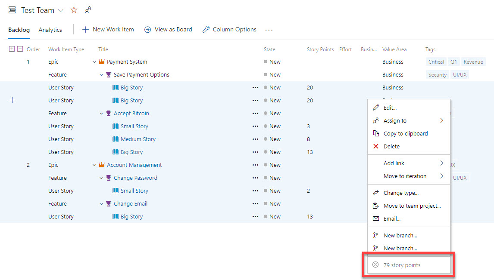

# Work Item Stats

Shows the count and story point sum of work items in the context menu.
I was tired of trying to add up story points in my head or open the items in Excel during planning. So I wrote this to quickly just show the sum of the story points for selected items in the context menu.

# Notes
## How To Build Extensions for Azure DevOps
https://docs.microsoft.com/en-us/azure/devops/extend/get-started/node?view=azure-devops

## How to build this extension
1. Install Node
2. `npm install -g webpack tfx-cli` to install global tools
3. Clone the repository
4. `npm install`
5. Build with `npm run build` and upload to your VSTS

## Credits
- Based on [Print Epic Cards](https://github.com/feldermark/PrintEpicCards)
